<!-- Generated by GitHub Profile Agent Console. Edit profile.config.json, then run npm run generate. -->

  <picture>
    <source media="(max-width: 760px) and (prefers-color-scheme: dark)" srcset="./assets/hero/agent-console-9ef467a3-mobile-dark.svg">
    <source media="(max-width: 760px)" srcset="./assets/hero/agent-console-9ef467a3-mobile-light.svg">
    <source media="(prefers-color-scheme: dark)" srcset="./assets/hero/agent-console-9ef467a3-dark.svg">
    <source media="(prefers-color-scheme: light)" srcset="./assets/hero/agent-console-9ef467a3-light.svg">
    
  </picture>

  

## About Me

Learning software development by building practical Java projects.

Improving coding skills through hands-on practice and real projects.

## Current Focus

| Area | What I am exploring |
| --- | --- |
| **Java** | Building Java applications with GUI and database integration. |
| **Software Development** | Learning software development through practical projects. |
| **Databases** | Learning MySQL and SQL through Java applications. |
| **Desktop Applications** | Building desktop applications using Java Swing. |

## Featured Work

| Project | Focus | Why it matters |
| --- | --- | --- |
| [**Kasir App**](https://github.com/muftiabunaseh0924/App-kasir) | Java Desktop Application | A Java cashier application with MySQL for managing products and sales. |

## Research Direction

Learning to build useful software through coding and practical projects.

## Tech Stack

`Java` · `Swing` · `MySQL` · `JDBC`

## Recent Activity

<!-- AUTO:ACTIVITY:START -->
_Recent public activity will appear here after the workflow runs._
<!-- AUTO:ACTIVITY:END -->

---

  Learning and building every day.

